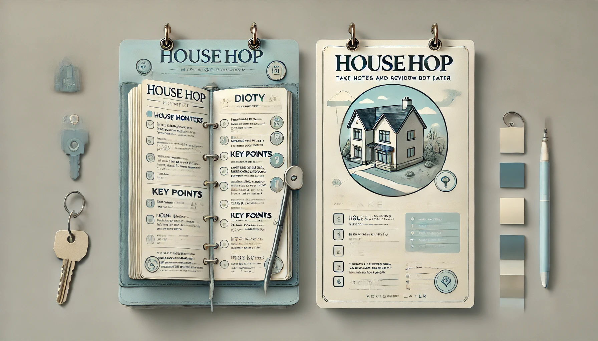

# **HouseHop**
**By: [Aditya Sharma](https://www.linkedin.com/in/aditya-sharma-3a0b6a190/)**

 

// add Planner page screenshot here

## Project Link
### Click here to go to **[HouseHop](https://house-hop-fdf44d2c76d6.herokuapp.com/)** 

## Description: 
// Enter project description here

## Technology Used 

  
 

 

## Project material: 

1.  Trello board
2. ERD diagram
3. Wireframes
4. Initial planning doc

## Motivation
// Enter motivation here 

## Attributions
// Enter attributions here

## Icebox functionalities
// Enter icebox features here