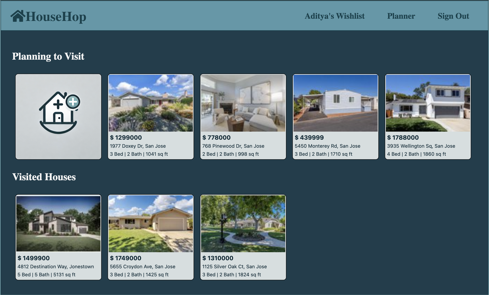

# **HouseHop**
**By: [Aditya Sharma](https://www.linkedin.com/in/aditya-sharma-3a0b6a190/)**

## Description

**[HouseHop](https://house-hop-fdf44d2c76d6.herokuapp.com/)** is an app designed to help homebuyers organize their home-hunting journey. Built using **MongoDB**, **Express.js**, and **Node.js**, it offers two key features: **Planner** and **Wishlist**.

* **Planner**: In the Planner, users can add houses they plan to visit and take notes on those they’ve already seen.

* **Wishlist**: The Wishlist page allows users to view their saved houses, categorized by properties with a rating of 4+, houses under budget, and those that meet both criteria—rated 4+ and under budget.

## Getting Started

Click here to go to **[HouseHop](https://house-hop-fdf44d2c76d6.herokuapp.com/)** app

 Project Planning (User Stories, ERD and Wireframes): **[Trello Board](https://trello.com/b/J8CAfquk/househop-08-12-08-18)**

## Technology Used 

  
 

 

## Motivation

Some of my friends recently bought homes and had a hard time keeping track of all the properties they visited, along with the pros and cons of each.

This inspired me to build an app that streamlines the home-buying process—one that I could also use for my own future home-buying adventure, once the housing market stabilizes, interest rates come down, and I have a job to pay the mortgage. 😉

## Attributions

* [Rapid API](https://rapidapi.com/) for providng free API named **Realty in US** to reproduce public data and features of Realtor - [realtor.com](realtor.com)
* [Heroku](https://www.heroku.com/): For providing a platform that enabled the deployment and hosting of this app
* [Coolors](https://coolors.co/) for offering an excellent tool to generate vibrant color palettes!
* [Icons8](https://icons8.com/icons) for providing high quality HTML, CSS, and JavaScript logos!

## Icebox Functionalities
* Add a profile tab to the navigation bar for users to check and update their profile details.
* Enhance the notes section by allowing users to categorize their notes into different sections of the property, such as Kitchen, Backyard, etc.
* Include labels and a dropdown menu on the Wishlist page to filter houses by different categories.